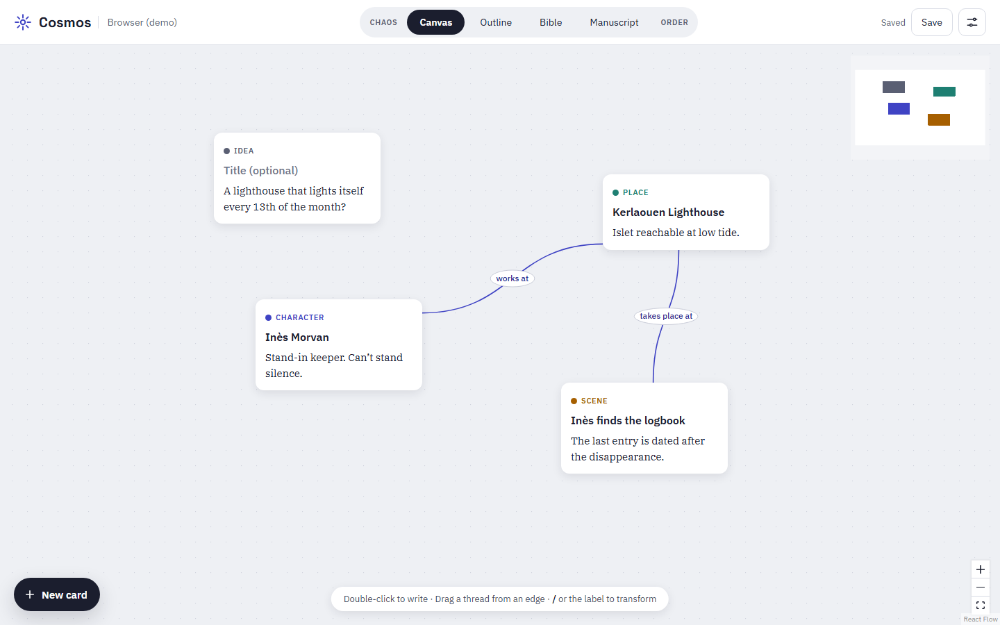
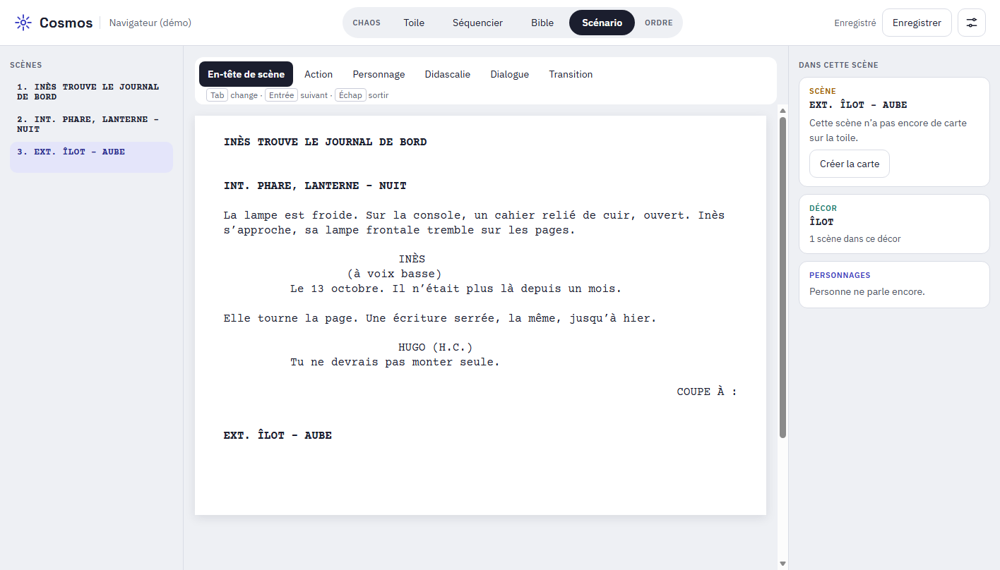
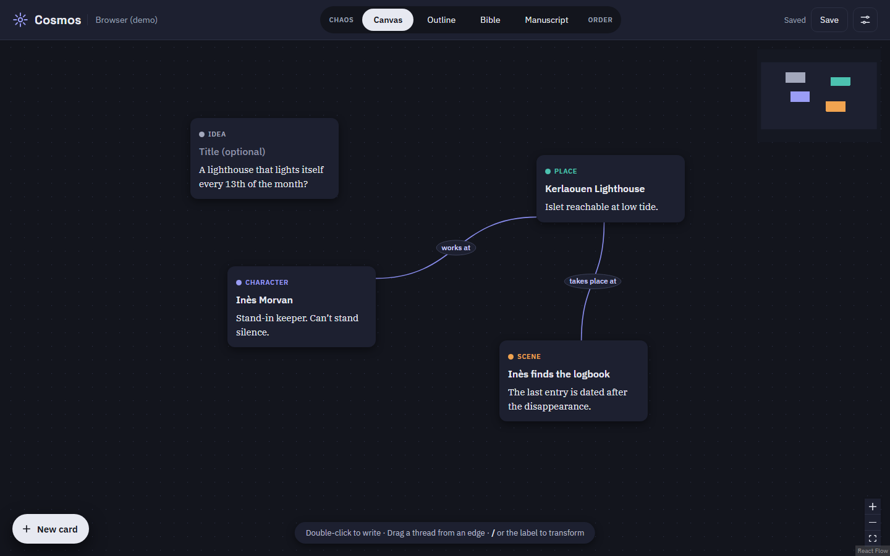

# Cosmos

[Français](README.md) · **English**

From chaos to an ordered world: a canvas for novelists and screenwriters who build their story before writing it.



## The idea

A story rarely starts with chapter one. It starts with fragments: an image, a character, a place, a question with no answer yet. Cosmos gives those fragments somewhere to land, then helps them grow into a coherent world, an outline and finally a text.

The app is made for “architect” writers, the ones who plan before they write. It rests on a few choices:

- **One content, several views.** Canvas, Outline, Bible and Manuscript are four readings of the same project. Nothing is ever copied from one view to another.
- **Structure emerges, you don’t configure it.** No forms, no required fields. A card is born an “Idea” and becomes a Character, a Place or a Scene when you decide so.
- **Three gestures are enough**: type, drag a thread, drop.
- **Your texts are yours.** A project is a folder of Markdown files, readable in any editor, with or without Cosmos.
- **AI asks questions, it doesn’t write for you.** It is planned for later and will stay optional.

## Features

Cosmos is under active development (version 0.1). Here is what works today.

### The canvas

- **Free-form cards**: double-click the canvas, long-press with a finger or use the “New card” button, and start writing. Rich text (bold, italic, lists).
- **Six card types**: Idea, Character, Place, Scene, Theme, Question. Change the type by typing `/` at the start of a line or by tapping the type label.
- **Labeled threads**: drag a thread from one card to another and name the link (“works at”, “suspects”, “takes place at”). The thread always leaves from the nearest edge.
- **Minimap and zoom** to find your way as the canvas grows.

### The Bible

A table of contents and reference sheets generated automatically from your cards, grouped by type, with each sheet’s links. There is nothing to fill in: the Bible updates as the canvas changes.

### Novels and screenplays

A project is a novel or a screenplay, and you can switch at any time. The canvas and the files stay the same, only the vocabulary adapts: Place becomes Location, the Outline becomes the Step outline, the Manuscript becomes the Screenplay, and Scene cards take the shape of a scene heading (`INT. LIGHTHOUSE - NIGHT`) in Courier Prime.

### The screenplay editor

For a screenplay project, the Screenplay view is an editor in standard film format:



- **Six elements**: scene heading, action, character, parenthetical, dialogue, transition, with the standard indents.
- **All from the keyboard**: `Tab` changes the element type, `Enter` moves to the next logical element (character, then dialogue, then action). An element bar does the same with a mouse or a finger.
- **Detection as you type**: a line starting with `int.` or `ext.` becomes a scene heading, an opening parenthesis starts a parenthetical.
- **Completion**: characters and locations from the Bible are suggested as you write, along with extensions (V.O., O.S.) and times of day (DAY, NIGHT). An unknown character or location can become a card in one gesture.
- **Linked to the canvas**: each scene heading is linked to its Scene card. Renaming one renames the other, and cards with no text wait under “Scenes to write”.
- **Pages and minutes**: the page count and the estimated running time (about one minute per page) are always visible, in US Letter or A4.
- **Step outline**: the list of scenes in order, with their length. Reorder them by dragging or with the arrows, and the scene’s text follows in the file.
- **Exports**: PDF in standard format (Courier 12, standard margins, dialogue split cleanly across pages), Fountain and Final Draft (FDX).
- **Import**: an existing `.fountain` file becomes a project, with its Scene, Character and Location cards already created and linked.
- **Scene numbers and focus mode**: optional numbering in the margin, and a mode that keeps only the page on screen.
- **An open file**: the text is saved to `scenario.fountain`, in [Fountain](https://fountain.io) format, readable by other screenwriting software.

### Comfort

- **Several projects**: a home screen to choose the one to work on, or to create one.
- **Autosave** to Markdown files, or `Cmd+S` / `Ctrl+S`.
- **English and French**, each with its own typography.
- **Light, dark or system appearance.**
- **Mouse, touch and keyboard**: every action has all three paths.
- **Offline**: bundled fonts, no account, no server.



### Coming next

| Step | Content |
|---|---|
| Canvas | Images, grouping frames, card resizing, search, undo and redo |
| Mentions | `@` in a card to create a thread automatically |
| Outline | Templates (Save the Cat, three acts, hero’s journey), slots to drop scenes into |
| Manuscript | Focused editor per scene, in the Outline’s order |
| Screenplay | Act templates and target lengths in the step outline, emphasis (italic, bold) on screen and in the PDF, side-by-side dual dialogue |
| Character assistant | Question banks by level, answers added to the sheet |
| Optional AI | “Tidy up” button, interview mode, consistency alerts |
| Export | Bible and manuscript as PDF, docx, epub |
| Mobile | iOS and Android apps |
| Sync | Across devices, then collaboration |

The Outline and Manuscript (novel) views are visible in the app but not built yet.

## Platforms

| System | Status |
|---|---|
| macOS (Apple Silicon and Intel), Windows, Linux | Ready: installers built by GitHub Actions |
| iOS, iPadOS, Android | Code is ready (touch, storage), native project still to initialize |
| Browser | For development (storage in the browser) |

Without an Apple signature (developer account, $99 a year), macOS shows a warning on first launch: right-click the app, then “Open”. The secrets needed for signing are listed in `release.yml`. Same idea on Windows (SmartScreen).

## Getting started

Requirements: Node 20+ and Rust (https://rustup.rs). Also, on Mac: the Xcode command line tools (`xcode-select --install`); on Windows: the Visual Studio Build Tools (C++) and WebView2 (already on Windows 10 and 11); on Linux: `libwebkit2gtk-4.1-dev` and its dependencies (see `ci.yml`).

```bash
npm install
npm run tauri dev      # desktop app
# or
npm run dev            # in the browser (http://localhost:1420), no disk access
```

The app opens on the home screen: the list of your projects and a “New project” form. On a computer, each project is a folder you choose; “Try with an example” creates a small project to explore.

**Mobile** (on a Mac): `npm run tauri ios init` then `npm run tauri ios dev` (Xcode required), or `android init` / `android dev` (Android Studio and NDK required). On mobile, projects live in the app’s private storage.

## Usage

- **Choose a project**: on every launch, the home screen lists your projects. From a project, the “Projects” button saves and goes back there.
- **New project**: a working title, novel or screenplay, and on a computer the folder to save it in.
- **New card**: double-click the canvas, long-press with a finger, or use the “New card” button. Then just write.
- **Change the type**: type **/** at the start of a line, or tap the type label (“IDEA”): Character, Place, Scene, Theme or Question.
- **Drag a thread** from a point on a card’s edge to another card, then name the link (“suspects”, “takes place at”). To rename it: double-click the thread (or a single tap with a finger).
- **Bible**: table of contents and sheets generated from the cards.
- Autosave, or **Cmd+S** (Ctrl+S on Windows and Linux).
- **Settings** (icon at the top right): project type (novel or screenplay), interface language (French, English) and appearance (system, light, dark).

## Files

Each project is a folder: `cosmos.json` (title, positions and links), `cartes/*.md` (one card per Markdown file) and, for a screenplay, `scenario.fountain`. They stay readable in any editor. File and folder names are the same in every language.

```markdown
---
id: k3x9a7bq2m
type: personnage
title: "Inès Morvan"
---
Stand-in keeper. Can’t stand **silence**.
```

To use a **writing project** (the folder opened in Cosmos, not the app’s code) on several computers, put that folder in iCloud Drive, Dropbox or OneDrive (avoid opening it on two machines at once).

The folder you choose in the app stays allowed from one launch to the next, wherever it is (another drive, OneDrive, a USB stick). If the app can no longer open it, it tells you and you choose it again with “Open folder”.

## Development

Tauri 2, React 19, strict TypeScript, Vite, React Flow for the canvas, TipTap for the editor, Zustand for state.

```bash
npm run build   # TypeScript check + build
npm test        # tests (Vitest)
```

**Releasing a version**: `git tag v0.1.0 && git push --tags`. GitHub builds the installers for all three systems and puts them in a draft Release, which you then publish.

The PDF embeds the Courier Prime font (SIL OFL licence, see [OFL.txt](src/assets/fonts/OFL.txt)).

Architecture, conventions and detailed roadmap: see [CLAUDE.md](CLAUDE.md) (in French), written for working with Claude Code.
