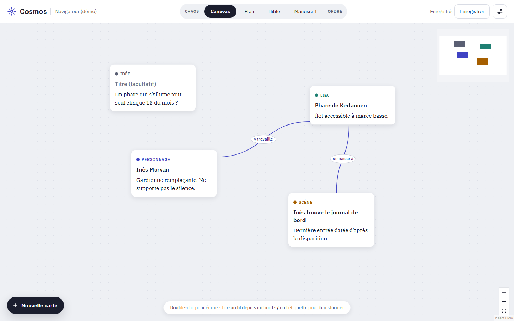

# Cosmos

**Français** · [English](README.en.md)

Du chaos au monde ordonné : un canevas pour les romanciers et les scénaristes qui construisent leur histoire avant de l'écrire.



## L'idée

Une histoire commence rarement par le chapitre un. Elle commence par des fragments : une image, un personnage, un lieu, une question sans réponse. Cosmos donne à ces fragments un endroit où se poser, puis les aide à devenir un monde cohérent, un plan et enfin un texte.

L'app s'adresse aux auteurs « architectes », ceux qui préparent avant d'écrire. Elle repose sur quelques partis pris :

- **Un seul contenu, plusieurs vues.** Canevas, Plan, Bible et Manuscrit sont quatre lectures du même projet. Rien n'est jamais recopié d'une vue à l'autre.
- **La structure émerge, on ne la configure pas.** Aucun formulaire, aucun champ obligatoire. Une carte naît « Idée » et devient Personnage, Lieu ou Scène quand tu le décides.
- **Trois gestes suffisent** : taper, tirer un fil, déposer.
- **Tes textes t'appartiennent.** Un projet est un dossier de fichiers Markdown, lisibles dans n'importe quel éditeur, avec ou sans Cosmos.
- **L'IA questionne, elle n'écrit pas à ta place.** Elle est prévue pour plus tard et restera optionnelle.

## Fonctionnalités

Cosmos est en cours de développement (version 0.1). Voici ce qui fonctionne aujourd'hui.

### Le canevas

- **Cartes libres** : double-clic sur le canevas, appui long au doigt ou bouton « Nouvelle carte », et tu écris directement. Texte riche (gras, italique, listes).
- **Six types de carte** : Idée, Personnage, Lieu, Scène, Thème, Question. On change de type en tapant `/` en début de ligne ou en touchant l'étiquette du type.
- **Fils étiquetés** : tire un fil d'une carte à une autre et nomme le lien (« y travaille », « soupçonne », « se passe à »). Le fil part toujours du bord le plus proche.
- **Mini-carte et zoom** pour s'y retrouver quand le canevas grandit.

### La Bible

Un sommaire et des fiches générés automatiquement à partir des cartes, classés par type, avec les liens de chaque fiche. Il n'y a rien à remplir : la Bible se met à jour quand le canevas change.

### Romans et scénarios

Un projet est un roman ou un scénario, et tu peux basculer à tout moment. Le canevas et les fichiers restent les mêmes, seul le vocabulaire s'adapte : le Lieu devient Décor, le Plan devient Séquencier, le Manuscrit devient Scénario, et les cartes Scène prennent la forme d'un en-tête de scène (`INT. PHARE - NUIT`) en Courier Prime.

### L'éditeur de scénario

Pour un projet scénario, la vue Scénario est un éditeur au format cinéma :


- **Six éléments** : en-tête de scène, action, personnage, didascalie, dialogue, transition, avec les retraits standard.
- **Tout au clavier** : `Tab` change le type de l'élément, `Entrée` passe à l'élément suivant logique (personnage, puis dialogue, puis action). Une barre d'éléments fait la même chose à la souris et au doigt.
- **Détection à la frappe** : une ligne qui commence par `int.` ou `ext.` devient un en-tête de scène, une parenthèse ouvre une didascalie.
- **Complétion** : les personnages et les décors de la Bible se proposent pendant que tu écris, avec les extensions (V.O., H.C.) et les moments (JOUR, NUIT). Un personnage ou un décor inconnu peut devenir une carte en un geste.
- **Relié au canevas** : chaque en-tête de scène est lié à sa carte Scène. Renommer l'un renomme l'autre, et les cartes sans texte attendent dans « Scènes à écrire ».
- **Un fichier ouvert** : le texte est enregistré dans `scenario.fountain`, au format [Fountain](https://fountain.io), lisible par les autres logiciels de scénario.

### Confort

- **Sauvegarde automatique** dans des fichiers Markdown, ou `Cmd+S` / `Ctrl+S`.
- **Français et anglais**, avec la typographie propre à chaque langue.
- **Mode clair, sombre ou comme le système.**
- **Souris, doigt et clavier** : chaque action a les trois chemins.
- **Hors ligne** : polices embarquées, aucun compte, aucun serveur.


### À venir

| Étape | Contenu |
|---|---|
| Canevas | Images, cadres de regroupement, redimensionnement des cartes, recherche, annuler et rétablir |
| Mentions | `@` dans une carte pour créer un fil automatiquement |
| Plan | Gabarits (Save the Cat, trois actes, voyage du héros), cases où glisser les scènes |
| Manuscrit | Éditeur focus par scène, dans l'ordre du Plan |
| Scénario | Compteur de pages et de minutes, séquencier, exports PDF, Fountain et FDX (en cours, voir [le plan](docs/plan-editeur-scenario.md)) |
| Assistant personnage | Banques de questions par niveau, réponses ajoutées à la fiche |
| IA optionnelle | Bouton « Ranger », mode interview, alertes de cohérence |
| Export | Bible et manuscrit en PDF, docx, epub |
| Mobile | Apps iOS et Android |
| Synchronisation | Entre appareils, puis collaboration |

Les vues Plan et Manuscrit (roman) sont visibles dans l'app mais pas encore construites.

## Plateformes

| Système | État |
|---|---|
| macOS (Apple Silicon et Intel), Windows, Linux | Prêt : installeurs fabriqués par GitHub Actions |
| iOS, iPadOS, Android | Code prêt (tactile, stockage), projet natif à initialiser |
| Navigateur | Pour le développement (stockage dans le navigateur) |

Sans signature Apple (compte développeur à 99 $/an), macOS affiche un avertissement au premier lancement : clic droit sur l'app, puis « Ouvrir ». Les secrets à ajouter pour signer sont listés dans `release.yml`. Même principe sous Windows (SmartScreen).

## Démarrer

Prérequis : Node 20+ et Rust (https://rustup.rs). En plus, sur Mac : les outils Xcode en ligne de commande (`xcode-select --install`) ; sous Windows : les Build Tools de Visual Studio (C++) et WebView2 (déjà présent sur Windows 10 et 11) ; sous Linux : `libwebkit2gtk-4.1-dev` et ses dépendances (voir `ci.yml`).

```bash
npm install
npm run tauri dev      # app desktop
# ou
npm run dev            # dans le navigateur (http://localhost:1420), sans accès disque
```

Au premier lancement, un petit projet d'exemple s'affiche. Dans l'app desktop, « Enregistrer » ou « Ouvrir un dossier » permet de choisir le dossier du roman.

**Mobile** (sur Mac) : `npm run tauri ios init` puis `npm run tauri ios dev` (Xcode requis), ou `android init` / `android dev` (Android Studio et NDK requis). Sur mobile, les projets sont rangés dans l'espace privé de l'app.

## Utilisation

- **Nouvelle carte** : double-clic sur le canevas, appui long au doigt, ou bouton « Nouvelle carte ». On écrit directement.
- **Changer le type** : taper **/** en début de ligne, ou toucher l'étiquette du type (« IDÉE ») : Personnage, Lieu, Scène, Thème ou Question.
- **Tirer un fil** depuis un point au bord d'une carte vers une autre, puis nommer le lien (« soupçonne », « se passe à »). Pour le renommer : double-clic sur le fil (ou simple appui au doigt).
- **Bible** : sommaire et fiches générés à partir des cartes.
- Sauvegarde automatique, ou **Cmd+S** (Ctrl+S sous Windows et Linux).
- **Réglages** (icône en haut à droite) : type de projet (roman ou scénario), langue de l'interface (français, anglais) et apparence (comme le système, claire, sombre).

## Fichiers

Chaque projet est un dossier : `cosmos.json` (titre, positions et liens), `cartes/*.md` (une carte par fichier Markdown) et, pour un scénario, `scenario.fountain`. Ils restent lisibles dans n'importe quel éditeur.

```markdown
---
id: k3x9a7bq2m
type: personnage
title: "Inès Morvan"
---
Gardienne remplaçante. Ne supporte pas le **silence**.
```

Pour retrouver un **projet d'écriture** (le dossier ouvert dans Cosmos, pas le code de l'app) sur plusieurs ordinateurs, il suffit de placer ce dossier dans iCloud Drive, Dropbox ou OneDrive (éviter de l'ouvrir sur deux machines en même temps).

Par défaut, l'app peut lire et écrire dans le dossier personnel et Documents. Pour un projet sur un disque externe, ajouter le chemin dans `src-tauri/capabilities/default.json` (permission `fs:scope`).

## Pour développer

Tauri 2, React 19, TypeScript strict, Vite, React Flow pour le canevas, TipTap pour l'éditeur, Zustand pour l'état.

```bash
npm run build   # vérification TypeScript + build
npm test        # tests (Vitest)
```

**Publier une version** : `git tag v0.1.0 && git push --tags`. GitHub fabrique les installeurs des trois systèmes et les dépose dans un brouillon de Release, qu'il reste à publier.

**Travailler sur plusieurs ordinateurs** : le code passe par GitHub (`git push` en fin de session, `git pull` puis `npm install` si besoin en début de session sur l'autre machine). Ne pas mettre le dossier du code dans OneDrive ou iCloud.

Architecture, conventions et feuille de route détaillée : voir [CLAUDE.md](CLAUDE.md), prévu pour travailler avec Claude Code.
